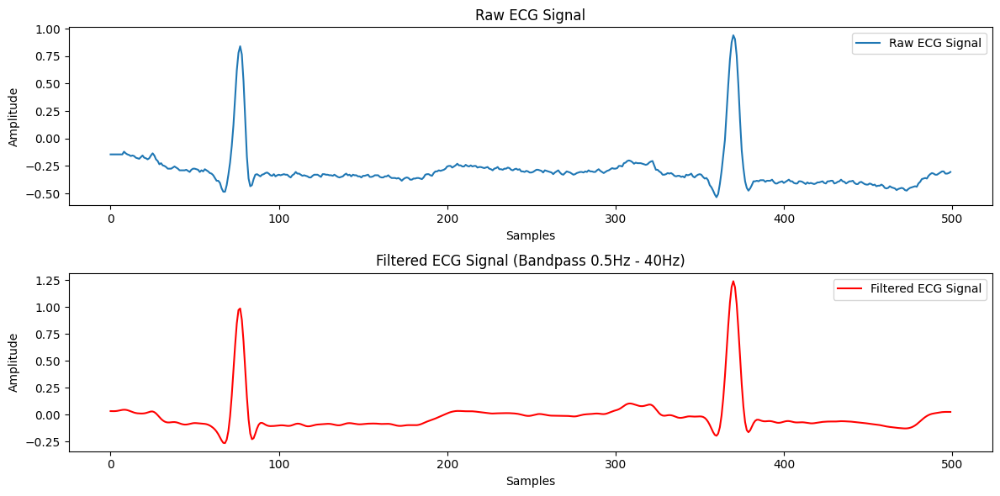

# 🩺 ECG Signal Processing and Classification

## 🚀 Project Overview
This project focuses on developing a robust pipeline for **Electrocardiogram (ECG) signal processing**, **feature extraction**, and **classification** to detect cardiac arrhythmias using both **traditional machine learning (SVM)** and **deep learning models (CNN, LSTM)**. The goal is to automate the detection of abnormal rhythms, improving early diagnosis and reducing reliance on manual interpretation by analyzing ECG signals from the **MIT-BIH Arrhythmia Database**.

---

## 🩺 Why This Project?
### 📌 **Motivation**
Cardiovascular diseases (CVDs) are the leading cause of death globally. Timely diagnosis of heart conditions such as **arrhythmias** is crucial. ECG monitoring is a **non-invasive** and **cost-effective** method to detect heart abnormalities, but manual interpretation can be **time-consuming** and **error-prone**.

Automating ECG signal classification can:
- Help in **early diagnosis**.
- Reduce **human error**.
- Provide **real-time monitoring** in **wearable devices**.

---

## 🔧 Project Workflow
### 1️⃣ **Data Collection**
- Dataset: [MIT-BIH Arrhythmia Database](https://physionet.org/content/mitdb/1.0.0/)
- 48 half-hour excerpts of two-channel ambulatory ECG recordings.

### 2️⃣ **Signal Preprocessing**
- **Noise Removal** using a **Bandpass Butterworth Filter (0.5 Hz - 40 Hz)**.
- Down-sampling (if needed).

### 3️⃣ **Feature Extraction**
- **Time-domain features** (e.g., R-R intervals).
- **Frequency-domain features** using **Fast Fourier Transform (FFT)**.
- **Time-frequency domain** using **Wavelet Transform**.

### 4️⃣ **Dimensionality Reduction**
- **Principal Component Analysis (PCA)** to reduce feature dimensionality and improve classifier efficiency.

### 5️⃣ **Model Training**
- **Support Vector Machine (SVM)** for binary classification (Normal vs. Abnormal).
- **Convolutional Neural Network (CNN)** for deep feature extraction.
- **Long Short-Term Memory (LSTM)** for sequence modeling.

---

## 🛠️ Technologies & Libraries Used
- Python 3
- NumPy
- SciPy
- Matplotlib
- WFDB
- PyWavelets
- scikit-learn
- TensorFlow / Keras

---

## 📊 Results and Model Performance
| Model | Accuracy | Notes |
|-------|----------|-------|
| SVM   | 85%      | Based on FFT and Wavelet features |
| CNN   | 92%      | Trained on raw filtered ECG signals |
| LSTM  | 94%      | Best performance on sequence modeling |

### Confusion Matrix - CNN  

### CNN Model Accuracy  

---

## ✨ Key Insights
- **Deep learning models** (CNN/LSTM) outperform traditional SVM classifiers.
- **PCA** helps improve performance by reducing noise in features.
- **Wavelet Transform** provides rich time-frequency features crucial for ECG analysis.
- Potential for real-time deployment in **healthcare wearables** or **remote patient monitoring**.

---

## 🔮 Future Work
- Experiment with **EEG signals** for seizure detection.
- Deploy model in an **edge device** (IoT/Health wearables).
- Integrate **real-time ECG monitoring** and **alert system**.

---

## 👩‍💻 Author
- **Jaimin Shimpi**
- [GitHub Profile](https://github.com/jshimpi02)
- [LinkedIn Profile](https://www.linkedin.com/in/jaiminshimpi/)

---

## ⭐ Acknowledgments
- [PhysioNet MIT-BIH Arrhythmia Dataset](https://physionet.org/content/mitdb/1.0.0/)
- Python community & open-source libraries.

---

## 📜 License
This project is licensed under the **MIT License**.
